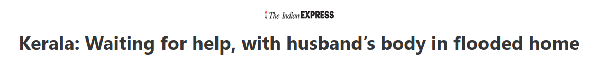
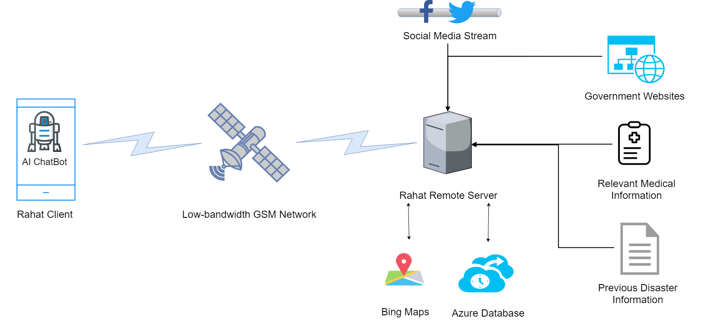

# Rahat

After features have been tested in ```Rahat-TestBench```, they make their way here.

A multi-lingual, end-to-end disaster management system in the form of a multi-functional services, that works with low-bandwidth GSM networks.

Azure URL: https://portal.azure.com/#@grassknotedgmail.onmicrosoft.com/resource/subscriptions/6f3567d9-00fb-4437-b860-ad87b126bd8f/resourceGroups/RahatFinal/providers/Microsoft.Compute/virtualMachines/RahatServerA/overview


## Abstract


Whether a flood, like in Kerala, or a tsunami like the one we witnessed in Palu, natural disasters leave a trail of death and destruction in their wake. 
In such situations, internet connectivity usually takes a hit, leaving people with limited to no bandwidth, and emergency services being deployed disproportionately.

To combat these issues, we propose _Rahat_, a multi-lingual, end-to-end multi-functional disaster management application that can be deployed on a smartphone. Without an internet connection, we alert users to evacuate in the event of an impending disaster and extract the location of the disaster victims while the onboard chatbot provides much-required information, thus potentially saving lives. 

Rahat is an elegant solution that can be used by both victim and rescuer with its goal being to bridge the existing gap between the two. 
Rahat contacts the victim first, getting information like how their location, number of victims, etc.
We also provide a Dashboard to rescue services enabling them to allocate resources better. Our platform can also be provided as an API.
Our app has a ChatBot that will intelligently help the victim by capturing his location and help him with any illness and general advice.
Rahat’s Pehchan also helps in identifying missing victims.

## Approach
**Binding Step:** Augmenting to the data collected from the previous steps, _Rahat_ will also allow the general public to send alerts and offer help and general information about the situation in their region.
With this information, we grade disaster-affected region, based on two factors:
* **Aftershock Probability** - Often, substantial damage occurs after the primary disaster. Areas with a high probability of aftershocks are given more importance.
* **Spread of diseases** - Based on the location, conditions, and coalition of victims, areas with high probability of a disease spreading is given more importance.

The areas are categorized into 3 main categories:
1.  Red Zone - Severely affected areas with minimal accessibility, needing immediate attention.
2.  Yellow Zone - Moderately affected areas with minimal accessibility, needing relatively urgent attention.
3.  Green Zone - Moderately affected areas with accessibility, needing attention without a comparative time constraint.

The map will also have locations of all the victims, relief camps, and rescue teams, to find optimal paths for rescue.
This information will also be gathered, formatted and sent to various NGOs, and government authorities so they can plan optimal relief camp locations, find the best path to a disaster victim, and use their resources efficiently with minimal wastage.


## Proposed Architecture



## Salient Features
* Multilingual application with regional language support
* Works without internet using low-bandwidth GSM networks
* On-board AI powered ChatBot used for helping with first-aid, missing people, updates, etc.
* General public can also provide help, and information
* Warns users about natural disasters and tracks their location
* Image Recognition helps identify missing and found people
* SOS button for disaster victims that tracks their location, and updates rescue teams

## Test Setup

Rahat's GSM server consists of a Raspberry Pi 3 coupled with a GSM 900A Module to scan for new messages and extract relevant information from them.


## Technology Stack

|         Component           |            Software           |
|-----------------------------|-------------------------------|
|     Application Platform    |            Android            |
|      ChatBot Framework      |    Microsoft Bot Framework    |
|  Regional Language Support  | Microsoft Translator Text API |
|        Geographic Maps      |     Microsoft Bing Maps API   |
|           Database          |   Microsoft Azure Databases   |
|    Social Media Scraping    |           Twitter API         |
|      Facial Recognition     |        Microsoft Face API     |
| Natural Language Processing |  Microsoft Text Analytics API |


## Team: C-3
|              **Members:**               |
|-----------------------------------------|
|  Akash Nagaraj (akashn1897@gmail.com)   |
|   Yash Mathur (mathuryash5@gmail.com)   |
| Mukund Sood (mukund.sood2013@gmail.com) |
